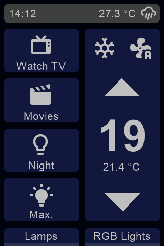
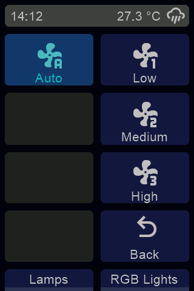
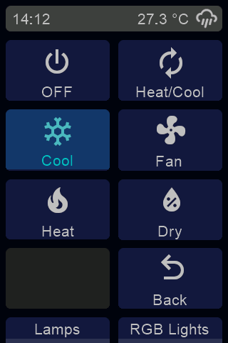

This is my custom HMI and ESPHome yaml file for the Sonoff NSPanel. I wanted to be able to control the living room lights and split a/c on the same screen. This is the design i came up with. There are 4 lighting scene buttons and a climate control interface. The relays of the NsPanel are not used with this configuration. Instead, the two physical buttons control light entities in home-assistant and the state is shown at the bottom of the screen.

I wanted up-down buttons to control the temperature which is the same way my a/c IR remote control works. 

The panel brightness control is reported as a light component instead of using a number component as i seen in other examples, this allows to set different panel brightness along with each scenes. 

Screenshots
-----------

Credits
-------

Icons from Material design icons (https://materialdesignicons.com/)

References from other nspanel projects
- https://github.com/marcfager/nspanel-mf
- https://github.com/masto/NSPanel-Demo-Files

